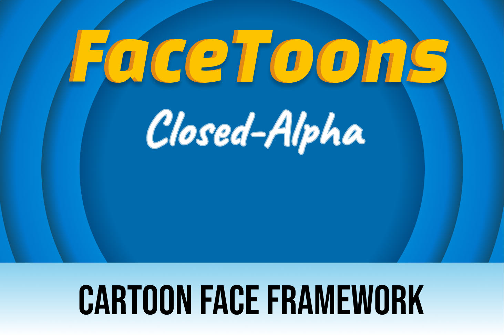

    

    <h1>Welcome to <b>Cineblend</b> docs!</h1>
    
Brings high-level virtual cameras workflow to the FlaxEngine. 

    <a href="./manual/Getting Started/index.md">Manual</a> | <a href="./api/Gasimo.CineBlend.CineblendMaster.yml">API</a> 
    

    <!--  -->

> This project is in early stages and its API is likely to change throughout development. This plugin was made for our own game production and will not receive priority support. PRs are welcome! If you wish this system to be included in the Flax ecosystem, make sure to share this repo!

## Features
- Priority based blending (Virtual Camera with highest priority will be active)
- Overriding priority by soloing Virtual Cameras.
- Camera blending previews work outside of Play Mode.
- Transition of all exposed Flax Camera values, including Far/Near plane, Orientation or Position.
- VirtualCamera Property PostProcessing, which allows you to non-destructively stack effects (such as CameraShake). These effects are not applied directly to the Virtual Camera transform, but are used while applying transform to the "real" Camera. See ICameraModule.
- Modular: All CineBlend cameras and effects work through interfaces to allow for easy implementation or extensions.
### Modules (Camera Effects)
- Camera Shake
- Recompose (additive Reframe)
- Look At (Camera faces a world transform, with smoothing options)
- Auto-Framing (Zooms and Rotates the camera to ensure a list of Actors remains on-screen)
- Large World Support using Reals

### To-Do
- PostProcessing Volume blending
- More Gizmos
- "Timeline/Sequencer" Integration

### Known Bugs
TBA