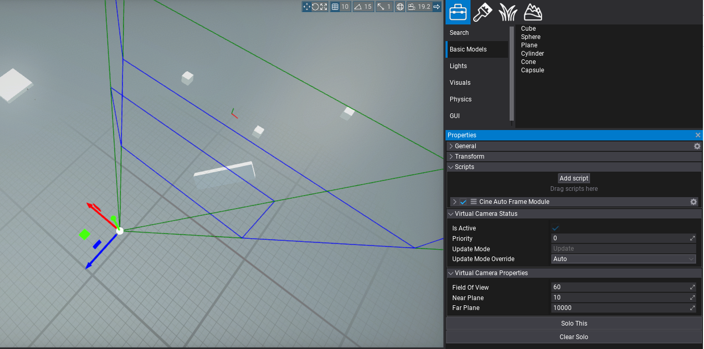

# Virtual Camera

## Overview
A simple camera proxy with no additional logic. You can tweak its values as you would with any physical camera. You can stack additional modules onto this Camera to override or modify its properties. Modules are applied sequentially. Depending on module type, it can either (override) a certain property or (additive) modify a property.

